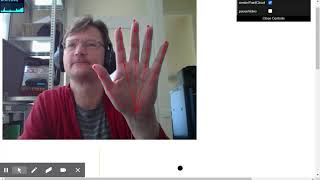

# WebXR hand tracking playground

This project uses the [MediaPipe Hands](https://google.github.io/mediapipe/solutions/hands) 
solution for adding hand tracking to the browser.
The detected hand poses are used for rendering 3d hand models in a  [three.js](https://threejs.org/)
scene. 

When running in a [WebXR](https://immersiveweb.dev/) enabled browser, the [hand tracking](https://immersive-web.github.io/webxr-hand-input/)
solution of the device itself will be used. 

In both cases, WebXR or non-WebXR, the same
scene is displayed.

### Demo video
This is a quick demo for hand tracking in the browser.

[](https://youtu.be/7FFeu797fLk)

## Usage
```
npm install
npm start
```
This will start the demo in a new browser page.
Wait for a few seconds for the video stream to start.
In the control panel, you can pause the video stream to get a higher FPS in the
three.js scene rendering.

## WebXR development
Below are a few useful links for WebXR development

### Enabling hand tracking
[Turn on Hand Tracking in Oculus Quest](https://support.oculus.com/2483094298688063)

### Remote debugging
[Debug Your Browser Content](https://developer.oculus.com/documentation/oculus-browser/browser-remote-debugging/)
